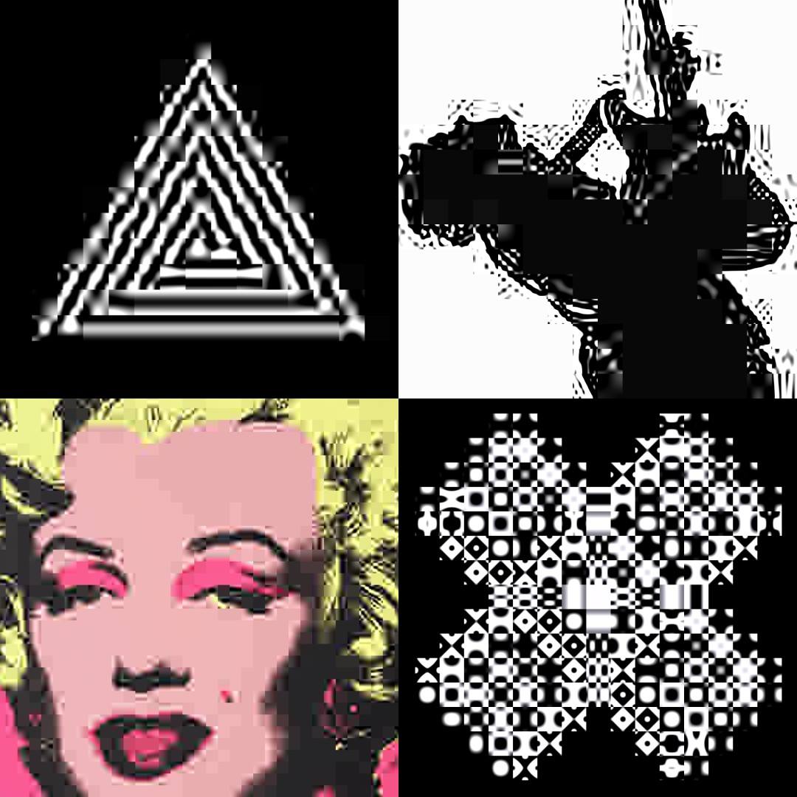

# DCTLive

WebGL implementation of DCT (Discrete Cosine Transform) and IDCT with real-time controls. Compress, glitch, and manipulate images and video using JPEG-like algorithms.



Design and API by geikha. DCT shader originally from [FMS-Cat](https://twitter.com/FMS_Cat) ([Testing DCT quantization shader](https://www.youtube.com/watch?v=xt4UFRPqX_w)). Thanks to [sol sarratea](https://solsarratea.world/) for the references. Implementation and documentation done using Claude Code.

## Install

```bash
npm install dctlive
```

Or use from CDN:
```html
<script src="https://unpkg.com/dctlive/dist/dctlive.js"></script>
```

## Quick Start

### Minimal Setup
```js
const dct = new DCTLive({ width: 512, height: 512 });
document.body.appendChild(dct.canvas);
await dct.initImage('image.png');
dct.start();
```

### Load Sources
```js
// Image from URL
await dct.initImage('https://example.com/image.jpg');

// Video from URL
await dct.initVideo('https://example.com/video.mp4');

// From file input
fileInput.addEventListener('change', async (e) => {
  const url = URL.createObjectURL(e.target.files[0]);
  await dct.initImage(url);
});

// From camera
await dct.initCam(0);  // First camera
await dct.initCam('Built-in Camera');  // Or by label
```

## Common Parameters

All parameters update in real-time:

```js
// Block size (larger = more blocky compression)
dct.blockSize = 16;

// Manipulate higher harmonics
dct.hfreq = 2.0;   // Sharpen-like behaviour

// Quantization (lose color/luminance like JPEG)
dct.qY = 50;   // Reduce luminance
dct.qC = 80;   // Reduce color
dct.yOnly = true;  // Drop all color

// Ignore harmonics
dct.lpf = 64;

// Frame rate
dct.fps = 30;
dct.fps = 0;  // Unlimited
```

## Display & Resolution

```js
// Display size in page (CSS)
dct.resizeCanvas(800, 600);

// Render resolution (processing resolution)
dct.setResolution(1024, 1024);

// How source maps to canvas
dct.input.fit = 'stretch';  // Default
dct.input.fit = 'fit';      // Letterbox
dct.input.fit = 'fill';     // Crop
```

## DCT/IDCT Control

Enable/disable transform passes independently:

```js
// Forward DCT (spatial → frequency domain)
dct.dctHorizontal = true;
dct.dctVertical = true;

// Inverse DCT (frequency → spatial domain)
dct.rdctHorizontal = true;
dct.rdctVertical = true;

// Or use setters
dct.setDCT(true, false);    // Only horizontal
dct.setRDCT(false, true);   // Only vertical inverse
```

## Full API

### Constructor
```js
new DCTLive({
  width: 256,         // Render width (default)
  height: 256,        // Render height (default)
  loop: true,         // Auto-start loop (optional)
  canvas: canvasEl    // Use existing canvas (optional)
})
```

### Source Loading (async)
- `initImage(url, opts)` — Image or HTMLImageElement
- `initVideo(url, opts)` — Video or HTMLVideoElement
- `initCanvas(canvas, opts)` — HTMLCanvasElement or context
- `initCam(selector, opts)` — Camera (index or label string)

### Rendering
- `run()` — One frame
- `start()` — Start loop
- `stop()` — Stop loop

### Display
- `show()` / `hide()` — Visibility
- `mount(element)` — Insert into DOM
- `unmount()` — Remove from DOM
- `resizeCanvas(w, h)` — Display size
- `setResolution(w, h)` — Render resolution

### Configuration
- `setFPS(fps)` — Frame rate
- `setDCT(h, v)` — Forward DCT passes
- `setRDCT(h, v)` — Inverse DCT passes
- `setUniform(name, val)` — Single uniform
- `setUniforms(obj)` — Multiple uniforms
- `setWaveFunction(glsl)` — Replace IDCT wave function
- `resetWaveFunction()` — Restore default

### Properties (Shorthand)
```js
dct.blockSize           // 2–64 (default 8)
dct.lpf                 // 0–128 (default 128, no blur)
dct.hfreq               // High frequency multiplier
dct.qY, dct.qC          // Luminance, chrominance quantization (0–100)
dct.qYf, dct.qCf        // Frequency-dependent quantization
dct.qA, dct.qAf         // Alpha quantization
dct.yOnly               // Drop color channels (bool)

dct.input.fit           // 'fit' | 'fill' | 'stretch'
dct.input.filter        // 'linear' | 'nearest' — sets both mag and min
dct.input.wrap          // 'clamp' | 'repeat' | 'mirror' | 'mask'

dct.fps                 // Get/set frame rate
dct.uniforms            // All shader parameters (object)
```

## Examples

### Real-time compression control
```js
const dct = new DCTLive({ width: 512, height: 512 });
document.body.appendChild(dct.canvas);
await dct.initImage('image.png');

// Slider to control compression
document.querySelector('input[type=range]').addEventListener('input', (e) => {
  dct.blockSize = e.target.value;
  dct.qY = e.target.value * 2;
});

dct.start();
```

### Show only coefficients
```js
dct.setDCT(true, true);      // Forward passes
dct.setRDCT(false, false);   // No reconstruction
dct.run();  // Shows raw frequency domain
```

### Frequency manipulation
```js
// Sharpen (boost high frequencies)
dct.hfreq = 2.5;
dct.run();

// Posterize (reduce color, keep luminance)
dct.yOnly = true;
dct.qC = 100;
dct.run();
```

## Notes

- **Loop default** — `loop: true` auto-starts rendering after any `init*` call
- **Async sources** — All `init*` calls return Promises; use `await`
- **Resolution vs display** — `setResolution()` changes processing; `resizeCanvas()` is CSS only
- **WebGL required** — No fallbacks for older browsers
- **CORS** — Loading external images/video requires CORS headers

## Development

```bash
npm install
npm run build
npm run dev     # Watch mode
npm run serve   # Dev server on port 3000
```

**License:** GPL-3.0
